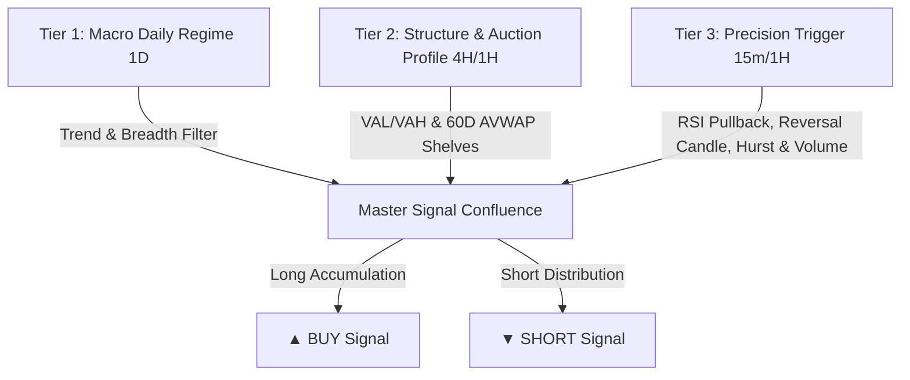

# Quantum Microstructure Multi-Timeframe Suite [Antigravity] (Pine Script v5)

This directory contains the production-grade TradingView Pine Script v5 implementations of the **Quantum Microstructure Multi-Timeframe Engine** supporting **Bidirectional Trading (Long + Short)** and **Hierarchical Multi-Timeframe Auto-Adaptation (Daily, 4H, 1H, 15m)**.

---

## Files in this Directory

1. **[`quantum_microstructure_swing_indicator.pine`](file:///c:/Users/SNigam2/.gemini/antigravity/scratch/stock_analyzer/tradingview/quantum_microstructure_swing_indicator.pine)**:
   - **Primary Visual Trading Suite** for live charting.
   - **Multi-Timeframe Auto-Adaptation**: Automatically locks Macro Trend & NIFTY 50 Regime to Daily (`1D`), Volume Profile to Structure (`1H`/`4H`), and executes sniper entry triggers on chart candles (`15m`, `1H`, `4H`, `1D`).
   - **Bidirectional Engine**: Long accumulation pullbacks + **Institutional Short Distribution breakdowns** ("selling stocks you don't own" for Intraday MIS equities and F&O Futures/Options).
   - Dynamic 21-EMA trailing stop (`High-Conviction Swing` profile) eliminates premature breakeven stop-outs on normal volatility.
   - Plots on-chart 30-Day Volume Profile Value Area (VAH, VWAP/POC, VAL), 60-Day Low/High Anchored VWAPs, and Trend EMAs (50/200).
   - Generates visually distinct `▲ BUY` (green) and `▼ SHORT` (crimson) badges with detailed interactive hover tooltips showing Entry, Initial SL, T1, T2, and T3 levels.
   - **On-Chart Institutional HUD Table** (top-right) displaying live execution status, macro trend, benchmark regime, volume profile state, Hurst exponent ($H$), liquidity z-score, and momentum.
   - Fully native TradingView alert conditions (`alertcondition`).

2. **[`quantum_microstructure_swing_strategy.pine`](file:///c:/Users/SNigam2/.gemini/antigravity/scratch/stock_analyzer/tradingview/quantum_microstructure_swing_strategy.pine)**:
   - **Strategy Backtester** for TradingView's built-in Strategy Tester tab.
   - Exactly mirrors the indicator's 3-Tier Multi-Timeframe hierarchy, bidirectional trade execution, partial position trims (25% at T1, 33% at T2, moonbag at T3), and dynamic trailing ratchet.
   - Allows instant backtesting of win rate, net profit, and profit factor on any stock across Daily, 4H, 1H, or 15m.

---

## 3-Tier Multi-Timeframe Architecture

When you switch between timeframes on TradingView, the algo automatically coordinates 3 distinct analytical tiers:

### 1. Tier 1: Macro Daily Trend & Benchmark Regime (`1D`)
- **Daily Trend Alignment**: Evaluates stock 50-EMA vs 200-EMA on true Daily bars (`request.security`).
- **NIFTY 50 Macro Gate**: Validates broader market breath (above 50 & 21 EMA for longs, or below for shorts).
- **Multi-Horizon Momentum**: Measures composite performance across 1M (15%), 3M (25%), 6M (40%), and 12M (20%) trading days.

### 2. Tier 2: Intermediate Market Structure & Auction Profile (`4H` / `1H` / `30D`)
- **60-Day Anchored VWAP Floor & Ceiling**:
  - **Long Floor**: Cost basis anchored from 60-day structural low (institutional accumulation shelf).
  - **Short Ceiling**: Cost basis anchored from 60-day structural high (institutional distribution ceiling).
- **30-Day Volume Profile Value Area (AMT)**:
  - **VAL Retest**: Longs trigger when price dips to Value Area Low (VAL) and finds institutional demand.
  - **VAH Rejection**: Shorts trigger when price pushes into Value Area High (VAH) and gets rejected.

### 3. Tier 3: Execution / Sniper Trigger (Chart Candles: `15m` / `1H` / `4H` / `1D`)
- **Precision Pullback**: Connors RSI(2) exhaustion ($\le 32$ for longs, $\ge 68$ for shorts) or test of the chart 21-EMA.
- **Micro Reversal Candle**: Bullish candle close for longs ($\text{Close} \ge \text{Open}$), bearish candle close for shorts ($\text{Close} \le \text{Open}$).
- **Chaos Hurst Exponent ($H > 0.50$)**: Rescaled Range persistence confirms trending flow vs mean-reverting chop.
- **Log Dollar-Volume Liquidity ($z \ge 0.15$)**: Ensures institutional volume participation on the trigger candle.

---

## Short Selling Engine ("Selling Stocks You Don't Have")

In Indian and global markets, selling stocks you do not currently own is known as **Short Selling**:
1. **Intraday MIS (Cash Equities)**: Sell in the morning and buy back (square off) before market close (3:15 PM on Zerodha, Groww, AngelOne).
2. **F&O (Futures & Options)**: Sell Stock Futures contracts or buy In-The-Money (ITM) Put Options for multi-day swing shorts.

### How the Short Distribution Setup Fires:
| Phase | Condition | Intuition |
|---|---|---|
| **Macro Weakness** | NIFTY 50 Bear Fortress or 6M Momentum $< 0\%$ | Market context is weak; path of least resistance is down. |
| **Trend Resistance** | $\text{Close} \le \text{EMA}_{50} \le \text{EMA}_{200} \times 1.02$ | Stock is in a confirmed structural downtrend. |
| **AVWAP Ceiling** | $\text{Close} \le 1.008 \times \text{AVWAP}_{\text{60D Structural High}}$ | Price is capped underneath institutional selling basis. |
| **VAH Rejection** | $\text{High} \ge 0.98 \times \text{VWAP}_{30\text{D}}$ and $\text{Close} \le 1.01 \times \text{VAH}_{30\text{D}}$ | Counter-trend rally fails at Value Area High resistance. |
| **Overbought Exhaustion** | $\text{RSI}(2) \ge 68$ or rejection at 21-EMA | Short-term buying momentum has completely exhausted. |
| **Bearish Trigger** | Bearish candle close + $H > 0.50$ + $z_{\ln(V)} \ge 0.15$ | Institutions step in to sell; downtrend resumes. |

### Downside Targets & Stop Management:
- **Initial Stop Loss**: Placed safely above 30D VAH / recent swing high $+ 1.5\times \text{ATR}$.
- **Target 1 (Downside)**: $\text{Close} - 1.00\times \text{ATR}$ $\to$ Trim 25% + ratchet Stop Loss to 21-EMA / Breakeven.
- **Target 2 (Downside)**: $\text{Close} - 2.80\times \text{ATR}$ $\to$ Trim 33%.
- **Target 3 (Moonbag Runner)**: $\text{Close} - 8.00\times \text{ATR}$ $\to$ Ride breakdown to the finish.

---

## Quick Setup Instructions for TradingView

### Step 1: Open TradingView
1. Navigate to [TradingView](https://www.tradingview.com/chart/) and open any stock or index chart (e.g., `NSE:TCS`, `NSE:HDFCBANK`, `NSE:RELIANCE`, `NSE:NIFTY`).
2. Select your desired timeframe:
   - **Daily (`1D`)**: Multi-week positional swing trading.
   - **4-Hour (`4H`)**: Multi-day intermediate swing trading.
   - **1-Hour (`1H`)**: Active multi-day momentum rides.
   - **15-Minute (`15m`)**: Precision sniper intraday / BTST / F&O execution.

### Step 2: Open Pine Editor
1. Click on the **Pine Editor** tab at the bottom of the TradingView window.
2. Click **New** $\to$ **Blank indicator script**.
3. Select all existing text (`Ctrl+A`) and delete it.

### Step 3: Paste and Save the Indicator
1. Open [`tradingview/quantum_microstructure_swing_indicator.pine`](file:///c:/Users/SNigam2/.gemini/antigravity/scratch/stock_analyzer/tradingview/quantum_microstructure_swing_indicator.pine).
2. Copy all code and paste it into the Pine Editor.
3. Click **Save** and name it `Quantum Microstructure Multi-Timeframe Engine`.
4. Click **Add to chart**.

### Step 4: Configure Inputs (Gear Icon on Indicator)
- **Trade Direction Mode**: Choose `Both (Long + Short)` for bidirectional trading, or `Long Only` if only trading equity cash delivery.
- **Strategy Profile**: Choose `High-Conviction Swing (Clean / Multi-Week)` for wide 21-EMA trend riding, or `Active Microstructure` for rapid breakeven locks.
- **Target 1 Badges**: Left unchecked by default to keep the chart ultra-clean.

---

## Real-Time TradingView Alert Setup

1. Press `Alt + A` or click the **Alerts** (alarm clock) icon on the right sidebar.
2. Under **Condition**, choose `Quantum Microstructure Multi-Timeframe Engine [Antigravity]`.
3. Select your alert:
   - `Quantum Long Signal`: BUY signal fires when institutional accumulation confluence aligns.
   - `Quantum Short Signal`: SELL SHORT signal fires when institutional distribution confluence aligns.
   - `Target 1 Reached (Trailing)`: Notifies you when T1 is hit to harvest partial profit and trail stop loss.
   - `Stop Loss / Trailing Exit Triggered`: Notifies you when a trade is closed.
4. Set **Trigger** to `Once Per Bar Close` (ensures zero repainting).
5. Choose notification method (App notification, Email, or Webhook URL).
6. Click **Create**.
